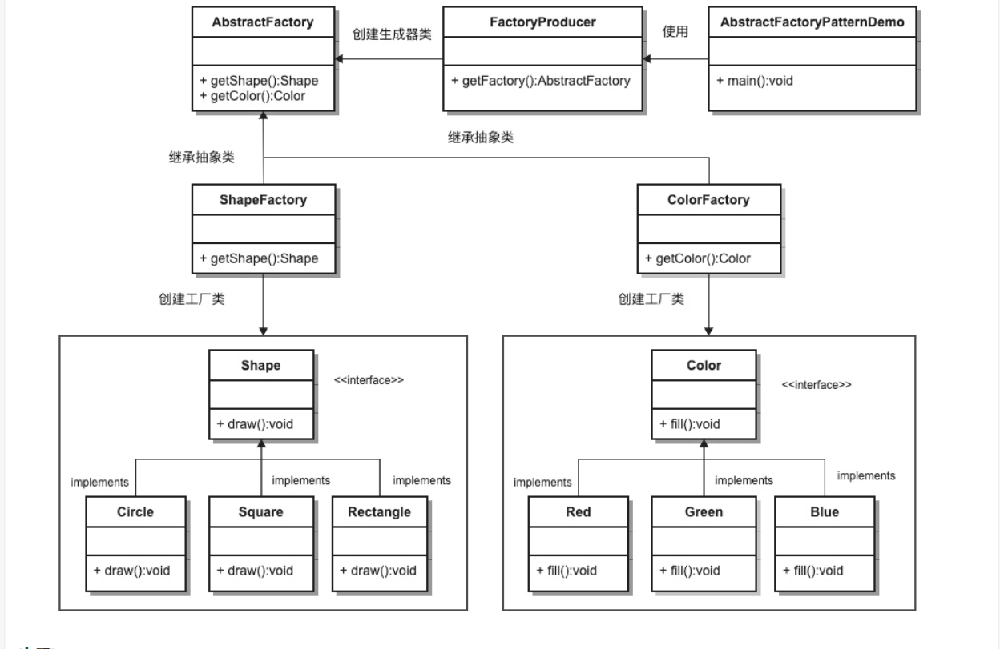

# 设计模式中的抽象工厂模式
* 抽象工厂模式属于创建型模式
* 抽象工厂模式（Abstract Factory Pattern）是围绕一个超级工厂创建其他工厂。该超级工厂又称为其他工厂的工厂。这种类型的设计模式属于创建型模式，它提供了一种创建对象的最佳方式。
* 在抽象工厂模式中，接口是负责创建一个相关对象的工厂，不需要显式指定它们的类。每个生成的工厂都能按照工厂模式提供对象。
* 应用实例：工作了，为了参加一些聚会，肯定有两套或多套衣服吧，比如说有商务装（成套，一系列具体产品）、时尚装（成套，一系列具体产品），甚至对于一个家庭来说，可能有商务女装、商务男装、时尚女装、时尚男装，这些也都是成套的，即一系列具体产品。假设一种情况（现实中是不存在的，要不然，没法进入共产主义了，但有利于说明抽象工厂模式），在您的家中，某一个衣柜（具体工厂）只能存放某一种这样的衣服（成套，一系列具体产品），每次拿这种成套的衣服时也自然要从这个衣柜中取出了。用 OOP 的思想去理解，所有的衣柜（具体工厂）都是衣柜类的（抽象工厂）某一个，而每一件成套的衣服又包括具体的上衣（某一具体产品），裤子（某一具体产品），这些具体的上衣其实也都是上衣（抽象产品），具体的裤子也都是裤子（另一个抽象产品）。
* 优点：当一个产品族中的多个对象被设计成一起工作时，它能保证客户端始终只使用同一个产品族中的对象。
* 缺点：产品族扩展非常困难，要增加一个系列的某一产品，既要在抽象的 Creator 里加代码，又要在具体的里面加代码。
* 使用场景： 1、QQ 换皮肤，一整套一起换。 2、生成不同操作系统的程序。 
* 注意事项：产品族难扩展，产品等级易扩展。



```golang
package main
import (
	"fmt"
	"math"
)

type Shape interface {
	CalcArea() float64
	String() string
}
type ShapeCreator interface {
	Creat() Shape
}

type circle struct {
	Radius	float64
}
type circleCreator struct {}
type rectangle struct {
	Height	float64
	Width	float64
}
type rectangleCreator struct {}
type square struct {
	SideLenght 	float64
}
type squareCreator struct {}

func (c circle) CalcArea() float64 {
	return math.Pi*c.Radius*c.Radius
}
func (c circle) String() string {
	return fmt.Sprintf("I am a circle")
}
func (c circleCreator) Creat() Shape {
	return circle{}
}
func (c rectangle) CalcArea() float64 {
	return c.Height*c.Width
}
func (c rectangle) String() string {
	return fmt.Sprintf("I am a rectangle")
}
func (c rectangleCreator) Creat() Shape {
	return rectangle{}
}
func (c square) CalcArea() float64 {
	return c.SideLenght*c.SideLenght
}
func (c square) String() string {
	return fmt.Sprintf("I am a square")
}
func (c squareCreator) Creat() Shape {
	return square{}
}

func main() {
	var s []ShapeCreator
	s = append(s, squareCreator{})
	s = append(s, circleCreator{})
	s = append(s, rectangleCreator{})
	for i := 0; i < len(s); i++ {
		fmt.Println(s[i].Creat().String())
	}
}
```