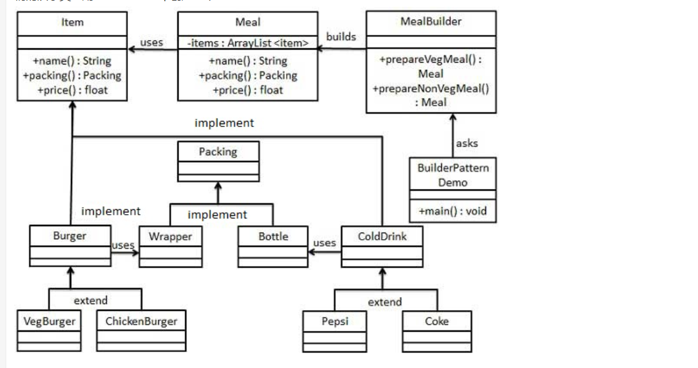

# 设计模式中的建造者模式
* 建造者模式属于属于创建型模式，它提供了一种创建对象的最佳方式。
* 建造者模式（Builder Pattern）使用多个简单的对象一步一步构建成一个复杂的对象。
* 一个 Builder 类会一步一步构造最终的对象。该 Builder 类是独立于其他对象的。
* 意图：将一个复杂的构建与其表示相分离，使得同样的构建过程可以创建不同的表示。
* 主要解决：主要解决在软件系统中，有时候面临着"一个复杂对象"的创建工作，其通常由各个部分的子对象用一定的算法构成；由于需求的变化，这个复杂对象的各个 部分经常面临着剧烈的变化，但是将它们组合在一起的算法却相对稳定。
* 何时使用：一些基本部件不会变，而其组合经常变化的时候。
* 如何解决：将变与不变分离开。
* 关键代码：建造者：创建和提供实例，导演：管理建造出来的实例的依赖关系。
* 应用实例： <br>
1、去肯德基，汉堡、可乐、薯条、炸鸡翅等是不变的，而其组合是经常变化的，生成出所谓的"套餐"。 <br>
2、JAVA 中的 StringBuilder。 
* 优点： <br>
1、建造者独立，易扩展。 <br>
2、便于控制细节风险。 
* 缺点：<br>
1、产品必须有共同点，范围有限制。<br>
2、如内部变化复杂，会有很多的建造类。 
* 使用场景： <br>
1、需要生成的对象具有复杂的内部结构。 <br>
2、需要生成的对象内部属性本身相互依赖。 
* 注意事项：与工厂模式的区别是：建造者模式更加关注与零件装配的顺序。
* 实现：<br>
我们假设一个快餐店的商业案例，其中，一个典型的套餐可以是一个汉堡（Burger）和一杯冷饮（Cold drink）。汉堡（Burger）可以是素食汉堡（Veg Burger）或鸡肉汉堡（Chicken Burger），它们是包在纸盒中。冷饮（Cold drink）可以是可口可乐（coke）或百事可乐（pepsi），它们是装在瓶子中。
我们将创建一个表示食物条目（比如汉堡和冷饮）的 Item 接口和实现 Item 接口的实体类，以及一个表示食物包装的 Packing 接口和实现 Packing 接口的实体类，汉堡是包在纸盒中，冷饮是装在瓶子中。
然后我们创建一个 Meal 类，带有 Item 的 ArrayList 和一个通过结合 Item 来创建不同类型的 Meal 对象的 MealBuilder。BuilderPatternDemo，我们的演示类使用 MealBuilder 来创建一个 Meal。



```golang
package main

import "fmt"

type IIterm interface {
	GetName() string
	GetPacking() Packing
	GetPrice() float64
}
type Packing interface {
	Pack() string
}

type Wrapper struct {
	Name string
}
func (w *Wrapper) Pack() string {
	return w.Name
}
type Bottle struct {
	Name string
}
func (b *Bottle) Pack() string {
	return b.Name
}

type Burger struct {
	Name string
	Pack Packing
	Price float64
}
func (b *Burger) GetName() string {
	return b.Name
}
func (b *Burger) GetPacking() Packing {
	return b.Pack
}
func (b *Burger) GetPrice() float64 {
	return b.Price
}
type VegBurger struct {
	*Burger
	Type string
}
func (v *VegBurger) GetType() string {
	return v.Type
}
type ChickenBurger struct {
	*Burger
	Type string
}
func (c *ChickenBurger) GetType() string {
	return c.Type
}

type ColdDrink struct {
	Name string
	Pack Packing
	Price float64
}
func (c *ColdDrink) GetName() string {
	return c.Name
}
func (c *ColdDrink) GetPacking() Packing {
	return c.Pack
}
func (c *ColdDrink) GetPrice() float64 {
	return c.Price
}
type Pepsi struct {
	*ColdDrink
	Style string
}
func (p *Pepsi) GetStyle() string {
	return p.Style
}
type Coco struct {
	*ColdDrink
	Style string
}
func (c *Coco) GetStyle() string {
	return c.Style
}

type Meal struct {
	items []IIterm
}
func (m *Meal) GetMealName() string {
	str := "The meal has:"
	for _, item := range m.items {
		str += " " + item.GetName()
	}
	return str
}
func (m *Meal) GetMealPrice() float64 {
	result := float64(0)
	for _, item := range m.items {
		result += item.GetPrice()
	}
	return result
}

type MealBuilder struct {

}
func (m *MealBuilder) PrepareVegMealWithPepsi() Meal {
	meal := Meal{}
	for i := 1; i <= 3; i++ {
		meal.items = append(meal.items, VegBurger{
			Burger: &Burger {
				Name:  "VegBurger",
				Pack:  &Wrapper{Name:"wrapper"},
				Price: float64(i*10),
			},
			Type:   "vegtable",
		})
	}
	meal.items = append(meal.items, Pepsi{
		ColdDrink: &ColdDrink{
			Name:  "Pepsi",
			Pack:  &Bottle{Name:"bottle"},
			Price: float64(50),
		},
		Style:     "pepsi",
	})


	return meal
}
func main() {
	mealBuilder := MealBuilder{}
	meal := mealBuilder.PrepareVegMealWithPepsi()
	fmt.Println(meal.GetMealName())
	fmt.Println(meal.GetMealPrice())
}
```